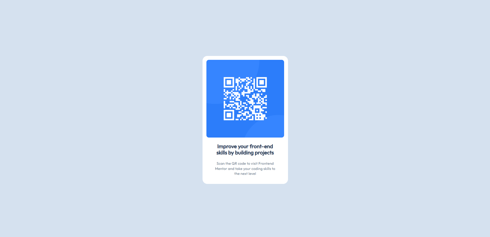

# Frontend Mentor - QR code component solution

This is a solution to the [QR code component challenge on Frontend Mentor](https://www.frontendmentor.io/challenges/qr-code-component-iux_sIO_H). Frontend Mentor challenges help you improve your coding skills by building realistic projects. 

## Table of contents

- [Overview](#overview)
  - [Screenshot](#screenshot)
  - [Links](#links)
- [My process](#my-process)
  - [Built with](#built-with)
  - [What I learned](#what-i-learned)
  - [Continued development](#continued-development)
  - [Useful resources](#useful-resources)
- [Author](#author)
## Overview

### Screenshot

### Links

- Solution URL: [https://github.com/DM-Radjo/qr-code-component](https://github.com/DM-Radjo/qr-code-component)
- Live Site URL: [https://qr-code-challenge-front-end-mentor.netlify.app/](https://qr-code-challenge-front-end-mentor.netlify.app/)

## My process

### Built with

- HTML
- CSS (Flexbox)

### What I learned

I learned how to effectively structuring HTML element and how to implemented Figma design to code.

### Continued development

For this challenge I still need to learn more about Responsive Web Design

**Note: Delete this note and the content within this section and replace with your own plans for continued development.**

## Author

- Website - [Dedika Marlon](www.linkedin.com/in/dedika-marlon)
- Frontend Mentor - [@DM-Radjo](https://www.frontendmentor.io/profile/DM-Radjo)